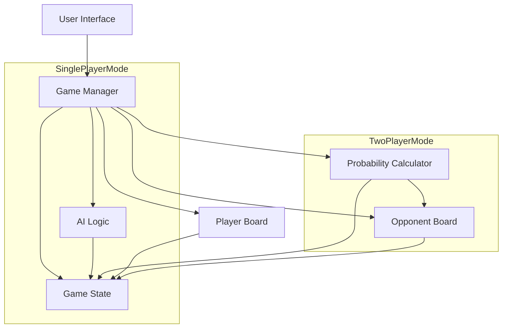

# System Patterns

## Architecture Overview
The AI Battleship project follows a component-based architecture with clear separation of concerns for both single-player and two-player modes:



## Key Components

### Game Manager
Central controller that:
- Orchestrates game flow
- Manages turn transitions
- Processes user input
- Updates game state
- Controls game phases (setup, play, end)
- Handles mode-specific logic (single/two-player)

### Board Component
Represents the game grid with responsibilities for:
- Supporting customizable grid dimensions
- Ship placement validation
- Attack processing
- State tracking (hit, miss, occupied)
- Visual representation

### Game State
Maintains the current state of the game:
- Ship positions and health
- Attack history
- Current player turn
- Game phase
- Win/loss conditions
- Selected game mode

### AI Logic (Single-Player Mode)
Handles intelligent computer opponent:
- Strategic ship placement
- Target selection algorithm
- Hit follow-up logic
- Difficulty adjustment

### Probability Calculator (Two-Player Mode)
Calculates hit probabilities for the opponent's board:
- Processes current game state (hits, misses)
- Analyzes remaining ship configurations
- Generates probability map
- Updates after each shot

## Design Patterns

### Model-View-Controller (MVC)
- **Model**: Game state, board state, ship data
- **View**: UI components, board visualizations, probability map
- **Controller**: Game manager, input handlers

### Observer Pattern
- Game state changes trigger UI updates
- Board state observers refresh visualizations when state changes
- Probability map updates when game state changes

### Factory Pattern
- Ship creation with configurable properties
- Board generation with customizable dimensions

### Strategy Pattern
- Pluggable AI difficulty levels
- Probability calculation algorithms

## Data Structures

### Game Board
```typescript
type CellState = 'empty' | 'ship' | 'hit' | 'miss';

interface Cell {
  state: CellState;
  shipId?: number;
  probability?: number; // For probability map
}

type Board = Cell[][];
```

### Ship Configuration
```typescript
interface Ship {
  id: number;
  length: number;
  positions: [number, number][]; // Array of [row, col] coordinates
  hits: number;
  isSunk: boolean;
}

type Fleet = Ship[];
```

### Probability Map
```typescript
type ProbabilityMap = number[][];  // 2D array of probability values (0.0 to 1.0)
```

## Data Flow
1. User input captured by UI
2. Input passed to Game Manager
3. Game Manager updates game state
4. For two-player mode, Probability Calculator updates probability map
5. State changes propagate to UI components
6. UI refreshes based on new state
7. Next player's turn begins or AI processes its turn when appropriate
8. Cycle repeats until end condition met

## Probability Calculation Algorithm
The probability calculation follows these steps:

1. Consider all possible valid placements of all remaining ships
2. For each cell, count the number of valid ship placements that would occupy that cell
3. Divide by the total number of possible ship placements to get a probability
4. Update the probability map with these values
5. Display the probability map to the player

This approach combines the Probability Density Function method with constraints based on known hits and misses. 